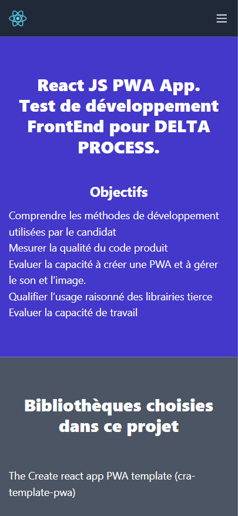
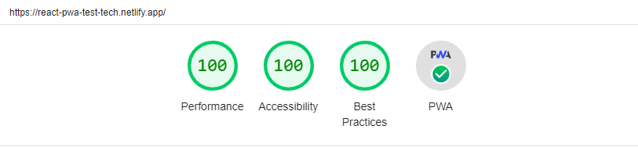

# React JS PWA
A React JS app to capture photos, videos and audios using WebRTC as a Progressive Web App


## What It Is

A simple React JS PWA demo that make use of WebRTC and Firebase Storage utilizing an app manifest, service workers and caching. This demo is written in React js. It has react-media-recorder, react-toastify and firebase as dependencies.


#### Demo: [https://react-pwa-test-tech.netlify.app](https://react-pwa-test-tech.netlify.app)








### Quick Start
Clone the repository:
```bash
git clone https://github.com/akrambichri/react-pwa-test-tech.git && cd react-pwa-test-tech
```

Install the dependencies:
```bash
npm install
```

Install the dependencies:
```bash
npm install
```
Add Firebase credentials:
```bash
./src/firebaseConfig.js
```

To start the project run following command in your terminal:
```bash
npm start
```

To build the project run the following command in your terminal:
```bash
npm run build
```

## Browser Compatibility

Hello PWA has been tested in the following browsers:

* Chrome 67 (Windows and Android)
* Firefox 60
* Safari 11
* Edge 42